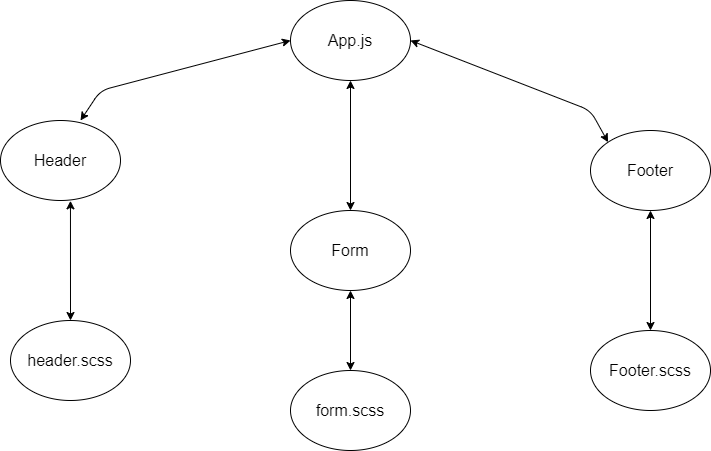
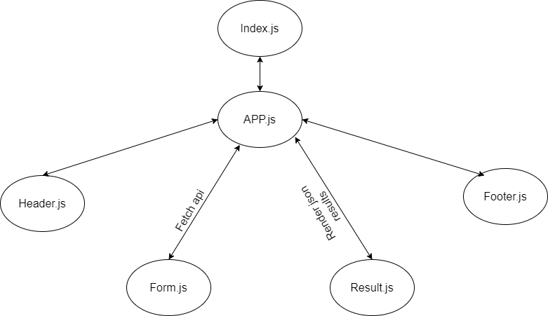
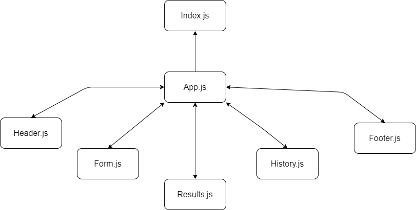
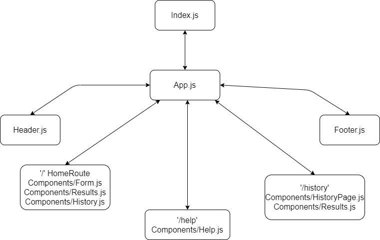

# Resty App
This project was bootstrapped with [Create React App](https://github.com/facebook/create-react-app).

## Available Scripts

In the project directory, you can run:

### `npm start`

Runs the app in the development mode.\
Open [http://localhost:3000](http://localhost:3000) to view it in the browser.

The page will reload if you make edits.\
You will also see any lint errors in the console.

##### Lab 26:

##### Lab 27:

##### Lab 28:

##### Lab 29:

## Links 

[Repo Link](https://github.com/yasmeenokh/resty/tree/base)

[Pull Requests](https://github.com/yasmeenokh/resty/pulls)

[Heroku Link](https://yasmeen-resty.herokuapp.com/)

[Netlify Link](https://boring-kowalevski-d42a0e.netlify.app/)